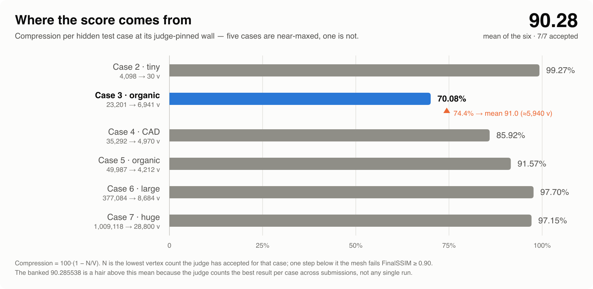

# Perception-Aware Mesh Simplification — IMC 2026, Problem B

Simplify a watertight 3D mesh to **as few vertices as possible** while a hidden judge's
six-view perceptual score stays above threshold. This repo is the full record of that
attempt: the solver, an offline reimplementation of the grader, and the
experiment log — 100 versioned submission snapshots, each with its judge verdict written
up, backed by a machine-readable log of every submission made.

**Final standing: `90.285538`, with all seven test cases passing.** A correct, tuned
textbook QEM decimator scores **~64** on the same judge. Everything between those two
numbers is in this repository, mechanism by mechanism.



Each bar is the **lowest vertex count the judge has ever accepted** for that case — one
step below it, the mesh fails. Five of the six are squeezed flat against their limit. The
entire remaining deficit is Case 3, and the chart states its price exactly: reaching a
91.0 mean means simplifying that one organic mesh **14% harder at identical quality**.
Knowing that number is most of what this project produced.

---

## The problem

Given a closed, watertight, pre-normalized mesh, emit a simplified mesh that satisfies
**every** constraint:

| | Constraint |
|---|---|
| **Validity** | `1 ≤ V' ≤ V`; every edge shared by exactly two faces; no degenerate faces; in-range indices |
| **Geometry** | symmetric Hausdorff `d_H(M, M') ≤ 5%` of the original AABB diagonal |
| **Perceptual** | `FinalSSIM ≥ 0.90` |
| **Budget** | ~21 s CPU per case |

**Score per case** = compression `100·(1 − V'/V)`, awarded **only if all constraints
hold** — otherwise zero. Final score = mean over the six hidden cases, which range from
5k to 1.1M vertices.

`FinalSSIM` is what makes this interesting. The judge renders both meshes from six fixed
axial cameras at 1024², producing a **flat-shaded normal map** (each triangle painted
with its own face normal) and a **perspective-correct depth map**, then takes an 11×11
box-window SSIM of each against the original, foreground-only:

```
FinalSSIM = mean over 6 views of [ 0.5·SSIM(normal map) + 0.5·SSIM(depth map) ]
```

So the objective is not geometric error. It is **what the mesh looks like when rendered**
— and the two diverge sharply, which is the whole story below.

Full specification, including the judge behaviours established experimentally:
[`docs/PROBLEM-AND-JUDGE.md`](docs/PROBLEM-AND-JUDGE.md).

## From 64 to 90.3

Every row is a judge verdict, not a local measurement. The snapshot of the exact
`main.cpp` that produced each one is in [`submissions/`](submissions/).

| | Mechanism | Score |
|---|---|---|
| v4 | Uniform QEM decimation, keep-ratio tuned — **the textbook baseline** | ~64 |
| v8 | Per-case dispatch + subset placement with a provable Hausdorff bound | 74.33 |
| v9 | Per-case keep ratios, calibrated against judge verdicts | 77.34 |
| v22 | **Pivot-A** — per-vertex rendered-SSIM deficit steers the collapse cost | 85.67 |
| v38 | **Visibility culling** — faces no camera can ever see are free to collapse | 88.67 |
| v43 | **VSA-lite** — order collapses by induced *normal* distortion, not position error | 89.36 |
| v45 | **nplace** — place the surviving vertex to minimize normal distortion | 89.49 |
| v100 | float32 refine buffers — 2× the gradient-ascent iterations inside the time box | 90.24 |
| v111 | Wall-probing endgame — every case driven onto its exact limit | **90.2855** |

The final figure is the scoreboard standing: the judge counts the **best result per case**
across all submissions, so it sits marginally above any single run (best single: 90.2761).

Two of these are worth singling out. **Visibility culling** (v38) came from asking what
the score *cannot* see: the metric is six fixed cameras, so geometry hidden from all six
contributes nothing and can be spent. **VSA-lite** (v43) moved Case 3 off a wall that
seventeen prior methods had failed to move, by changing *what* the collapse ordering
minimizes — normal distortion rather than position error — which is the objective the
judge actually renders.

## How the solver works

One file, [`solver/main.cpp`](solver/main.cpp), no dependencies beyond Eigen. Four stages:

1. **Quadric edge-collapse core** (Garland–Heckbert) — a lazy-deletion priority queue with
   version stamps and a manifold-safety gate on every collapse.
2. **Perceptual collapse ordering** — the cost is not geometric. VSA-lite ranks collapses
   by induced normal distortion; `nplace` picks the placement that minimizes it; Pivot-A
   multiplies in a per-vertex deficit measured from an actual render; invisible geometry
   is discounted.
3. **Inverse-rendering refinement** — with connectivity frozen, rasterize all six views,
   differentiate the rendered SSIM analytically with respect to every vertex position,
   and gradient-ascend. This optimizes the judge's metric directly.
4. **Per-case dispatch** — six meshes spanning 5k to 1.1M vertices need different
   parameters and different time budgets; the operating point is compiled in per case.

Walkthroughs: [`docs/theory/solver-anatomy.md`](docs/theory/solver-anatomy.md) (narrative)
and [`docs/SOLVER-FUNCTION-REFERENCE.md`](docs/SOLVER-FUNCTION-REFERENCE.md) (per-function).

## The hard part was measurement, not meshing

The judge reports pass/fail. No score, no reason, no partial credit — and the test meshes
are hidden. Optimizing against a black box is the real problem this project had to solve,
and most of the repository exists because of it.

**An offline judge.** [`src/imc_eval/`](src/imc_eval/README.md) reimplements the grader in
Python — the same cameras, rasterizer, encoding, window and masking rules — validated to
reproduce its arithmetic. Ambiguities in the specification were pinned against real
verdicts rather than guessed: the 11×11 window is a *box*, not Gaussian, because a
Gaussian window reads 0.854 at an operating point the judge accepts at ≥0.90. The render
path is verified bit-for-bit; the Hausdorff term deliberately is not — the oracle computes
point-to-surface where the judge (per an official clarification) compares vertex-to-vertex,
which makes the local check strictly stricter than the real one.

**A wall-probing harness.** [`probe/`](probe/README.md) treats the judge as a noisy oracle.
Because scoring is best-per-case across submissions, a failed probe costs nothing
permanent — so the vertex count itself can be used as a **side channel**: the solver
encodes its own self-measured score into the output vertex count, and the harness decodes
it from the returned number. It plans probes, refuses to submit any that would decode
ambiguously, halts on an unexpected verdict, and maintains a per-case wall ledger
([`probe/wall_model.json`](probe/wall_model.json)).

**A graveyard.** [`docs/postmortems/`](docs/postmortems/) records what failed and why —
including results that killed multi-day plans before they were built. It is the most
useful directory here.

**The lesson that cost the most.** Local gains routinely do not transfer. Three separate
attempts to build an instrument predicting judge behaviour from local measurements were
each falsified against ground truth. In the sharpest case, a judge-side read implied ~240
vertices of headroom on Case 3; the true wall was ~20 vertices away. Measured local
improvements in the wrong subspace are not weak evidence — they are *anti*-evidence, and
[one such law was quantified](experiments/kern-registration-descent/NOTES.md):
position-space gains found at 512² transfer to 1024² at roughly **−0.5×**, inverting sign.
That single result retroactively explained three earlier judge failures.

## What is still unsolved

Case 3 — a 23,201-vertex organic mesh stuck at 70% compression while everything else
reaches 86–99%. It is diagnosed, not fixed
([`docs/postmortems/case3-intrinsic-wall.md`](docs/postmortems/case3-intrinsic-wall.md)):

- The deficit is **100% the SSIM structure term** (`l = 1.000`, `c = 0.998`, `s ≈ 0.81`).
  The simplified mesh paints normals of the right magnitude in the wrong pixels — a
  registration failure, not a shading one.
- It is **spatially broad** (Gini 0.237), **uniform across all six views**, and
  **uncorrelated with where the pipeline puts faces** (`corr = +0.01`).
- It is worst where the surface is *gently* curved (`corr(deficit, normal richness) =
  −0.50`) — textbook SSIM contrast masking: sharp features self-mask and are cheap.

Those three findings jointly rule out the entire reallocation class of fixes, which is why
they are stated here rather than a list of untried ideas. What remains is documented in
[`docs/Future/STRUCTURAL-ROADMAP.md`](docs/Future/STRUCTURAL-ROADMAP.md).

A dirty-region SSIM kernel — scoring a local mesh edit by its exact effect on the rendered
image in ~1 ms, bit-exact to 5.6e-16 — was built to attack this and works, finding ~+0.008
of genuine headroom above the converged pipeline. It is also, honestly, about an order of
magnitude short of what a 91.0 would need
([NOTES](experiments/kern-registration-descent/NOTES.md)).

> **On the competition:** contest-time observation put the leading entries near ~91.5.
> No standings are stored in this repo, so that figure is an estimate and is not charted
> anywhere here. The `64 → 90.29` comparison above is against this project's own
> baseline, on the same judge and the same hidden cases, and is fully reproducible from
> the snapshots in `submissions/`.

## Repository layout

```
solver/main.cpp        the single file submitted to the judge
src/imc_eval/          offline reimplementation of the grader (Python)
probe/                 wall-probing harness — plan, verify, submit, decode
submissions/           100 versioned snapshots, each with its judge result
docs/
  PROBLEM-AND-JUDGE.md the authoritative judge model (verified facts)
  theory/              derivations: the algorithm, and why SSIM's variance term is the wall
  postmortems/         what failed and why — read before reviving any idea
  Future/              the structural roadmap and ranked open ideas
experiments/           self-contained investigations with their own notes
scripts/               oracle validation, judge submission, diagnostics
tests/data/            watertight reference meshes (bunny, armadillo, cow, fandisk)
```

## Build and run

```bash
./scripts/setup.sh
```

Creates `.venv` (numpy/scipy, plus numba where wheels exist), locates Eigen and symlinks
it beside the solver, compiles, and runs the oracle self-check. macOS (Homebrew) and
Linux (`libeigen3-dev`).

<details><summary>Manual setup</summary>

```bash
python3 -m venv .venv && source .venv/bin/activate
pip install -e .
brew install eigen                  # Linux: apt-get install libeigen3-dev
ln -sfn "$(brew --prefix eigen)/include/eigen3/Eigen" solver/Eigen
g++ -O2 -std=c++17 solver/main.cpp -o solver/main
```
</details>

Verify the oracle reproduces the judge on known inputs:

```bash
python scripts/validate_oracle.py
```

Score a simplified mesh against its original:

```bash
imc-score --input mesh.in --output mesh.out
```

`numba` is optional; without it the rasterizer falls back to pure Python — correct, just
slower.
