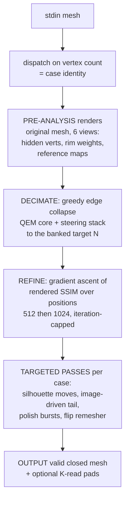
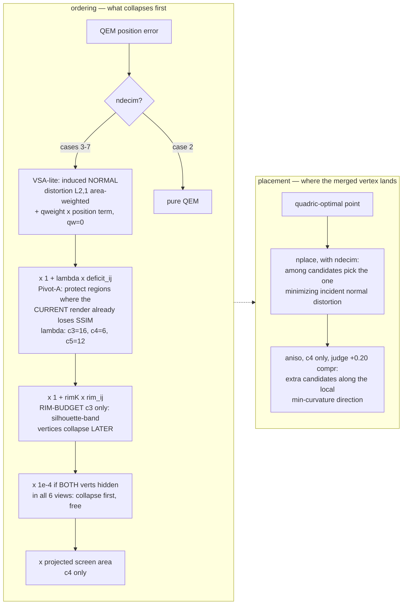
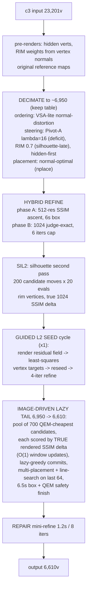
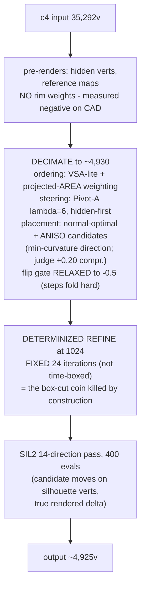

# THE ALGORITHM — abstract logic, start to finish

STATE: 2026-07-15, written from the live `CleanRepoForAI` source (bank 90.592). Purpose: a precise,
implementation-free map of WHAT the solver does and WHY, so new ideas (and old papers) can be
matched against it slot by slot. Metric math details → `THEORY.md`. Road verdicts → `ROADS.md`.
Judge facts → `JUDGE-ENVELOPE.md`. This document owns the *logic*.

---

## 1. The contract (what cannot change)

The judge holds 6 hidden meshes (cases 2–7; case 1 is a sample). For each, our single C++17 program
receives the mesh on stdin and must print a simplified mesh. Per case:

- **Validity**: closed 2-manifold, every face non-degenerate. (Multiple disconnected closed
  components ARE accepted — proven by the tetra-pad submissions.)
- **Geometry**: vertex-to-vertex Hausdorff ≤ 5% of the bounding-box diagonal — *loose*: it compares
  vertex SETS, not surfaces. Vertices may move anywhere that keeps every output vertex near some
  input vertex and vice versa.
- **Appearance**: `FinalSSIM ≥ 0.90`, where FinalSSIM = mean over **6 fixed axial orthographic
  views** (±X, ±Y, ±Z) of ½·(SSIM of the flat-shaded **normal map**) + ½·(SSIM of the **depth
  map**), rendered at fixed resolution, SSIM over 11×11 windows **including background pixels**
  (judge-confirmed by probe).
- **Score**: `100·(1 − N/V)` — fewer output vertices = more points; mean over the 6 cases.
- **Budget**: ~21 s CPU per case (soft ceiling, machine-dependent), single translation unit
  ≤ 128 KiB, a compile-memory cliff (~110 MB), Eigen available, **no environment variables**.
- **Economy**: best-counts scoring — a failed submission can never lower the bank.

The judge dispatches nothing; **we** dispatch on the input vertex count. Each case sits in a known
band, so "per-case logic" = "per-band logic":

| case | input V (band) | output N (banked) | compression | mesh character |
|---|---|---|---|---|
| c2 | ≤ 7,000 (~4.1k) | 28 | 99.3% | tiny organic |
| c3 | 7k–30k (23,201) | 6,610 | 71.5% | **organic scan, normal-detail dense** |
| c4 | 30k–40k (35,292) | ~4,925 | 86.1% | **CAD-like, sharp features, depth steps** |
| c5 | 40k–100k (~50k) | 4,140 | 91.7% | organic (armadillo-class) |
| c6 | 100k–400k (~377k) | 8,680 | 97.7% | large organic |
| c7 | > 400k (~1M) | ~27,100 | 97.3% | huge organic |

---

## 2. The one-paragraph idea

**Greedy quadric-error (QEM) edge-collapse decimation chooses WHICH vertices survive; a stack of
per-case steering terms bends that choice toward what the judge's perceptual metric actually
rewards; then image-space optimization moves the surviving vertices to maximize the real rendered
score.** The solver renders itself exactly what the judge renders (6 views, normal+depth maps) and
uses those images three ways: *before* decimation (visibility & rim analysis), *during* decimation
(deficit steering, image-driven tail), and *after* decimation (SSIM gradient ascent on vertex
positions). Everything else is per-case budgeting of a fixed ~21 s time box.

---

## 3. The measurement core (the judge inside the binary)

The solver contains a faithful re-implementation of the judge's scoring (verified: self-score ==
oracle to 4 decimals; the residual +0.010 optimism vs the *judge* is mesh difference, not math).

- **Renderer**: orthographic rasterizer, 6 axial views, producing per-pixel face **normals**
  (flat-shaded) and **depth**. Resolutions: cheap (160–512) in-loop, judge-exact (1024) for final
  optimization. For meshes ≤ 100k a **column crop** restricts SSIM evaluation to the object's
  bounding columns (identical values, big speedup — this speed win *funds* other mechanisms).
- **Score** `S2 = ½·S2n + ½·S2d` (normal / depth channel means over 6 views) — the self-estimate of
  FinalSSIM, used for *relative* decisions only.
- **Gradient**: the normal-map SSIM has an analytic gradient with respect to vertex positions —
  this is what makes "refine" a proper local optimizer rather than a heuristic.
- **What binds where** (measured): c3 binds on **normal-map structure** (σxy correlation; depth
  saturated ~0.98). c4 binds on the **depth channel** (steps/pockets; normals stay ~0.97). c5–c7
  bind on normal structure at extreme compression; c2 on sheer vertex starvation.

---

## 4. The QEM foundation and the steering stack

Plain QEM (Garland–Heckbert): every vertex carries the sum of its faces' plane quadrics; an edge
collapse costs the quadric error of the merged vertex at its optimal position (solved in closed
form, midpoint fallback near-singular quadrics); a global min-heap commits the cheapest collapse,
gates reject collapses that flip face normals (threshold per case) or break manifoldness.

Everything case-specific enters as **multipliers on the collapse cost**, **a different ordering
metric**, or **a different placement rule**:

Gates: normal-flip threshold is strict (0.0) everywhere except **c4 (−0.5, relaxed)** — CAD steps
legitimately fold hard. c7 runs **2-stage**: bulk plain-QEM to 3× the target (speed), then the
ordered metric for the final stretch.

Two facts about this foundation, measured this week on a faithful instrument and confirmed by a
judge differential: **the ordering is near-optimal** (true rendered-SSIM greedy selection ≈ QEM
selection) and **the final positions are converged** (stronger optimizers, restarts, and swap
searches all read ≈ 0). The foundation is not where the remaining points are.

---

## 5. The refine engine (shared, cases 2–6)

After decimation, positions are re-optimized against the actual rendered score:

1. **Reference**: the ORIGINAL mesh's 6 normal maps were rendered before decimation.
2. **Phase A** (hybrid, c3): gradient ascent at 512 res inside a ~6 s box (converges locally).
3. **Phase B**: judge-exact 1024 polish from the 512-converged state — **iteration-capped** (c3: 6)
   rather than time-boxed.
4. **Mini-refine bursts**: short re-polish after any later pass that moves vertices (c3 repair:
   1.2 s / 8 iters; c5 POLISH: 1.5–2.0 s — judge-validated +6.9e-4).

**Determinism doctrine (R-κ)**: every loop that used to stop on the wall clock now stops on an
iteration count sized to fit the judge's box. Rationale: the judge's slower/variable CPU used to
cut time-boxed loops mid-trajectory, producing a *different mesh every run* (the "box-cut coin",
σ ≈ 1–2e-3 SSIM). Iteration caps make the output a pure function of the binary — reproducible
banking, A/B-able reads. This week's judge reads confirmed it: four submissions, bit-identical
payouts.

---

## 6. CASE 3 — the deep dive (28.5 case-points of room; the binding term is σxy)

The c3 mesh is a detail-dense organic scan (23,201 verts). Its wall is the **structure term of the
normal-map SSIM**: at 71.5% compression the rendered normal field loses the fine spatial
correlation the original has. Depth is saturated. Every mechanism below exists to spend the 6,610
vertex budget where normal-structure survives best.

Why this shape:

- **The tail is the sharp end.** The last ~340 collapses are chosen not by any proxy metric but by
  *actually rendering the result* of each candidate collapse and keeping the best (lazy-greedy over
  a pool of QEM-cheapest candidates; a prefix-sum trick makes each evaluation O(1) per SSIM
  window). This is where the judge-validated ordering gains came from (image-driven decimation ≈
  Lindstrom–Turk 2000, but judged on the *exact* target metric).
- **Rim-budget is the one validated allocation idea**: silhouette-band vertices (normal ⟂ view
  axis) carry disproportionate σxy, so they collapse last (wall moved 6700→6610).
- **Everything after decimation only moves positions** — and positions are *proven converged*
  (M0 falsifier; judge differential v5: doubling the polish budget bought < 2.5e-4). The c3 wall
  at 6,610 is therefore a **vertex-budget wall, not an optimization wall**: S(N) slope ≈ 1.25e-5
  per vertex, so a 91-relevant improvement (−570v) needs **+0.007 SSIM from a structurally
  different mesh** — selection, positions, ordering, kernels, schedules, and polish are all
  measured exhausted in this family (four independent falsifiers + one judge differential).

## 7. CASE 4 — the deep dive (13.9 case-points of room; the binding term is DEPTH)

The c4 mesh is CAD-like (35,292 verts, sharp features, distinct depth levels). Measured on the
calibrated ABC instrument: at 86% compression the **normal channel stays ~0.97 while the depth
channel collapses** — steps, pockets and thin features at distinct z are what die. The c4 stack is
therefore feature-preserving and *time-rich* (c4 has ~5 s headroom other cases don't).

Why this shape:

- **Aniso placement is c4's signature win**: on CAD, elongating triangles along the min-curvature
  direction preserves sharp edges at extreme budgets (+0.20 compression judge-proven). The same
  mechanism is judge-WA on every organic case — the sharpest example of per-case dispatch.
- **Determinized refine**: c4 was the worst box-cut coin (pass rates swung 30–50% ↔ 1/34 by machine
  speed); fixed-24-iterations made it a pure function of the binary.
- **What is measured dead** (this week, calibrated instrument + noise-floor analysis): depth-aware
  collapse *penalties*, subset placement, saliency-scaled quadrics — all inert or
  trajectory-noise-bound (the c4 trajectory noise floor is ±0.03 S2d — huge; any mechanism must
  beat it). The wall is **quality-at-ratio in the depth channel**, not topology, not Hausdorff, not
  the collapse logic. Nothing in the current family addresses depth structure *directly* — the
  depth channel has no analogue of rim-budget, no depth-deficit steering that survived testing,
  and the refine's gradient is normal-map-driven with depth entering only through the score. **c4's
  depth term is the least-attacked binding term in the project.**

## 8. The other cases in one line each

- **c2**: decimate 4.1k→28, refine (6 s budget). At the SSIM wall (27 WA'd repeatedly) — closed.
- **c5**: c3-like stack minus rim, plus **C5-POLISH** (deeper post-decimation mini-refine — the one
  case with CPU margin ratio 1.6×) and a flip remesher pass; wall moving slowly (4163→4140).
- **c6**: plain ordered decimation to 8,684, crop-off rendering family, refine; VSA-mesh
  near-optimal at its rung [LOCAL] — a throughput-bound case, not a mechanism-bound one.
- **c7**: 2-stage bulk-QEM×3 → ordered finish, **no refine** (TLE); near-optimal at its rung.

---

## 9. What is FIXED vs OPEN (the idea-hunting map)

**Fixed by contract** (do not attack): the metric definition (incl. background-in-window, 6 fixed
axial views), thresholds, v2v Hausdorff form, ~21 s/case, source/compile limits, no-env, hidden
inputs, count dispatch.

**Fixed by strong evidence** (need a genuinely new angle, not a re-run — see ROADS §2):

| claim | evidence class |
|---|---|
| Flat/partition remeshing loses on organic (VSA −2.5×) | LOCAL decisive + theory |
| Collapse-selection metric is maxed (SSIM-greedy ≈ QEM) | LOCAL ×2 scales |
| Final positions are converged (+5e-4 ceiling) | faithful instrument + **judge differential** |
| Local vertex-set swaps are flat (+1.5e-5) | faithful instrument |
| Position-space local gains don't transfer in magnitude | judge, repeatedly (latest: polish v5) |
| Big-case tails are not starvation walls | LOCAL exact scorer |
| Zero-vertex "paint" components can't beat σxy | LOCAL exact scorer, mechanism-level |
| Trajectory noise floors: c4 ±0.03 S2d, c3-schedule ±3e-3 | measured; any idea must exceed them |

**The 5 "open dimensions" — ALL MEASURED 2026-07-15/16. None survived.** (Kept with their verdicts:
this is the idea-hunting map, and its value now is telling you what NOT to re-derive. Full rows in
`ROADS.md §2`; numbers in `zoo/README.md`.)

1. **The global vertex set / representation** — ~~open~~ **CLOSED, 3 ways.** (a) From-scratch remesh:
   Instant Meshes 0.9005 / MMGS-aniso 0.8799 / MMGS-iso 0.8726 vs ours 0.9524 at equal N — remeshers
   RESAMPLE: they optimize the non-binding Hausdorff (3–4e-3 vs a 1.14e-2 limit) and low-pass the
   binding normal field, while QEM keeps vertices ON original detail. (b) Constructive redistribution
   (edge-split at deficit + collapse at saturation): **judge-WA ×4**, confounds excluded one by one
   [20043585/20044274/20044330/20044572] ⇒ *the c3 deficit is resolution-bound, not reallocatable.*
   (c) LT-2000 teleports re-measured on the faithful ruler: **+0.0013** (per-mille). Field-aligned
   meshing IS now tested — the "never tested locally" note is obsolete.
2. **The σxy objective, attacked directly** — ~~open~~ **CLOSED by the CONTINUITY LAW** (3 independent
   proofs): 2D impostors 0.689 vs 0.810 · per-view relief shells dominated at every budget · slat
   painting (interpenetration, legality judge-proven) WORSE than its own base. Mechanism: any
   discontinuous overlay pays O(perimeter) boundary damage (hard normal edges + depth cracks) that
   exceeds its interior gain; the fix converges to "make it continuous" = the honest mesh. Flat
   shading + region-mean ⇒ the only σxy freedom is region SHAPE, and QEM+nplace+refine already take it.
3. **c4's depth channel** — ~~open~~ **CLOSED, judge-typed.** G_WD (depth-SSIM in the refine gradient,
   joint Pareto) is the first mechanism to ever ascend it: dose-response +5e-4 @wd=0.5, WA @wd=1.0
   (gradient real) — **but the sign FLIPS across rungs** (WA at 4950 where the control passes)
   ⇒ trajectory-noise-dominated, no stable payoff. Decimation-time depth (penalty/subset/allocation)
   = inert or noise. *One untested descendant:* interior depth-contour SIL2 (coverage/directed-move
   class, not gradient).
4. **Time reallocation** — ~~open~~ **RE-PRICED to ~+0.04 total, not +0.23.** The "+4e-3 deep tail at
   +4.5 s" was a **blob-scale artifact** (§ instrument bug below): on the unit ruler pool_2500 buys
   +0.0007. And depth itself is capped: **9× compute = +0.006** at rung 5800 (the leader gap would
   need ~1e9×). Tail carries all of it; refine adds nil (positions converged, reconfirmed).
5. **Legality surface** — **probed hard, all doors shut** (each in the judge's own words, via the
   validator messages): far-tetra → *"too much geometric deviation"* (Hausdorff ENFORCED as stated);
   header under-declaring V → *"mesh is invalid"* (the checker parses the whole file and cross-checks
   the header); impossible-N → *"SSIM is too low"*; disconnected/interpenetrating components are legal
   but the metric kills every use (see #2); background-window dilution refuted by K-read arithmetic.

**⚠ INSTRUMENT BUG that invalidated older numbers:** the `probe/cache/c3cand/*` proxies were **9.5×
under-normalized** (rendered as ~34-px blobs; `ply2solver.py` never normalized), so every
image-driven magnitude measured on them before 2026-07-16 is wrong (signs survived). Use
`happy_unit`/`dragon_unit` (controls 6/6 & 5/5) or Alberto's `instrument/` (unit-scale all along).

**The strategic summary in one sentence** *(rewritten 2026-07-16)*: every algorithmic dimension —
representation, σxy generation, c4 depth, throughput, and the legality surface — is now MEASURED at
its ceiling (paradigm ≈ 90.60, and the night bot banked it: 90.59475); the leaders at 93.77 are
~19 summed points away, which no mechanism we can construct explains, so the remaining work is
**information retrieval** (the contest clarifications page, teammate sync), not algorithm invention.
