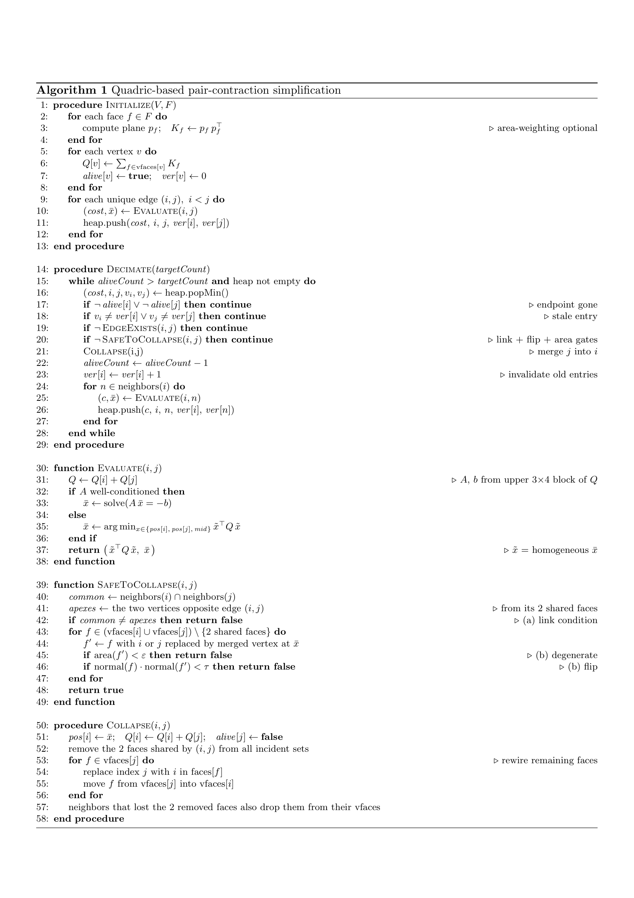

The task is one constrained optimization:

maximize compression subject to (vertex-coverage Hausdorff ≤ 5%·diag, SSIM ≥ 0.9, manifold).

The algorithm that respects the constraints tightly is the compression maximizer. So:

"Pass all 7" = never violate the constraints on any mesh.
"Push compression" = ride right up against whichever constraint binds.

This is the base algorithm adapted to the challenge case.
The first phase is the initialization phase, where for each face in the mesh, (in our case every triangle of the mesh), we compute the plane $p_f$.
Then for each vertex we compute the error, summing the squared distance from the vertex into consideration and every plane attached to that vertex.
For improving the search and editing of the algorithm use a flag alive for each vertex, so that when a vertex is collapsed, we do not need to remove it from that heap, operation that will cost $O(log n )$, indeed we can just flag it as dead.
While $ver[v]$ is a version counter, it counts how many times a vertex has been touched by a *collapse*, it' used to do a lazy deletion.## Why it's called *lazy* deletion

"Lazy" means you **defer the cleanup**. The moment an entry becomes
invalid, you do *nothing*. 
You don't search for it, you don't remove it.
You simply wait until that entry naturally rises to the top of the heap,
and only *then* check whether it's still valid and discard it if not.

The opposite would be **eager** deletion: the instant an entry goes bad,
you hunt it down in the heap and remove it immediately. That's the
expensive option, and here's why:

- A binary heap is only ordered along root-to-leaf paths. There is **no
  index** telling you where an arbitrary entry like `(i, n)` lives inside
  it. To delete it eagerly you'd have to scan the whole array — `O(n)`
  per stale entry. After a collapse touches several edges, that cost adds
  up fast.

- Lazy deletion turns that into something cheap: each stale entry costs
  just **one `O(log n)` pop** to recognize and skip — *and only if it ever
  reaches the top at all*. Many stale entries have high cost, so they sink
  to the bottom of the heap and get buried under cheaper valid entries.
  Those may **never surface**, so you pay nothing for them.

So you trade a guaranteed expensive cleanup for a cheap check that you
only run on demand. The version counter `ver[v]` is what makes that
on-demand check possible.

---

## Worked example

We track a single edge, `(3, 7)`, through the heap.

**Start.** Edge `(3, 7)` is evaluated and pushed. At this instant
`ver[3] = 0` and `ver[7] = 0`, so the entry freezes that snapshot:

    entry A:  cost = 0.5,  snapshot = (v3 = 0, v7 = 0)

**A collapse happens elsewhere.** Some other vertex gets merged into
vertex 3. Vertex 3 survives, but its quadric changed
(`Q[3] = Q[3] + Q[merged]`), so **every cost involving 3 is now wrong**,
including entry A. To flag this, we bump the counter:

    ver[3] : 0  ->  1

We then re-evaluate 3's edges and push fresh ones, including a corrected
`(3, 7)` with the *new* snapshot:

    entry B:  cost = 0.9,  snapshot = (v3 = 1, v7 = 0)

The heap now holds **two entries for the same edge** — the stale A and the
fresh B. Note we never removed A; it's still sitting in there.

**Popping A (the stale one).** It's cheaper (0.5), so it likely surfaces
first. We compare its frozen snapshot against the *live* counters:

    stored v3 = 0   vs   ver[3] = 1   -> MISMATCH

The mismatch says vertex 3 was modified after A was pushed, so A's cost is
outdated. We `continue` — discard it and pop the next thing. **This is the
deletion finally happening, lazily, at the moment A reached the top.**

**Popping B (the fresh one).** Later B surfaces and we check again:

    stored v3 = 1   vs   ver[3] = 1   -> OK
    stored v7 = 0   vs   ver[7] = 0   -> OK

Both match, so B was computed from data that hasn't changed since. It's
valid — we process the collapse.

---

## Two guards, two different failures

`Decimate` checks `alive` *and* `ver` because they catch different things:

- `alive[j] == false`  -> endpoint `j` was **deleted entirely**
  (it was the vertex merged away). Its edges can never be valid again.

- `ver` mismatch        -> endpoint **survived but its cost is stale**,
  exactly the case in the example above.

Only the survivor's counter is bumped (`ver[i] += 1`), because only its
quadric changed. A neighbor's edges that don't pass through `i` are still
correct, so leaving their versions untouched keeps them valid — no
needless re-evaluation.

Then for each unique edges we evaluate the cost, find the optimal $\bar{x}$ and push the cost and the optimal on the min-heap.

Difference from the original paper's algorithm:

It's the paper's edge-contraction QEM (the t = 0 variant), plus a manifold-safety gate. Within that gate, the flip check is already the paper's; the area check is basic validity; the genuinely problem-specific addition is the link condition that keeps the mesh a closed 2-manifold — which the paper neither needs nor enforces.

Here is the complete pseudocode:
